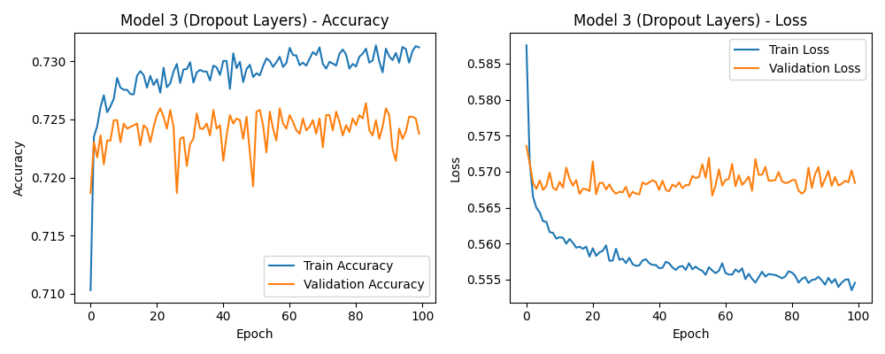

# Module 21 Report

## Overview of the Analysis

The objective of this analysis is to develop and optimize a deep learning model capable of predicting whether a charity will receive successful funding. The target performance for the model is set at 75% accuracy. To achieve this, several optimization techniques were applied, including the removal of non-beneficial columns, modification of the network architecture, and the application of advanced activation functions.

## Results

### Data Preprocessing

- Target Variable:
    - The target variable is IS_SUCCESSFUL, a binary variable indicating whether a charity successfully secured funding (1) or not (0).

- Features:
    - The features used for prediction are the categorical and numerical variables left after preprocessing. Variables such as APPLICATION_TYPE and CLASSIFICATION were one-hot encoded, and all numerical features were scaled.

- Variables Removed:
    - During the optimization process, the following columns were removed:
        - EIN, NAME, ORGANIZATION, STATUS, and SPECIAL_CONSIDERATIONS. These variables either represented unique identifiers or did not contribute meaningful information for prediction.

### Compiling, Training, and Evaluating the Model

Model 1: Initial Model

- Architecture:
    - Layers: 2 hidden layers.
    - Neurons: 100 neurons in the first layer, 50 neurons in the second layer.
    - Activation Functions: ReLU for hidden layers, Sigmoid for output.
    - Epochs: 100.
- Performance:
    - Accuracy: 72%.
    - This model did not meet the target accuracy, prompting further optimization.

Model 2: Additional Hidden Layers

- Architecture:
    - Layers: 3 hidden layers.
    - Neurons: 100 neurons in the first layer, 80 in the second, and 50 in the third.
    - Activation Functions: ReLU for all hidden layers, Sigmoid for output.
    - Epochs: 200, Batch Size: 54.
- Performance:
    - Accuracy: 73%.
    - The addition of an extra hidden layer and increasing the number of epochs provided a slight improvement in accuracy but did not reach the target.

Model 3: Dropout Layers

- Architecture:
    - Layers: 2 hidden layers with Dropout layers after each hidden layer.
    - Neurons: 100 neurons in the first layer, 50 neurons in the second layer.
    - Activation Functions: ReLU for hidden layers, Sigmoid for output.
    - Epochs: 100, Dropout Rate: 20%.
- Performance:
    - Accuracy: 73%.
    - Dropout layers were added to prevent overfitting, but the improvement was minor.

Model 4: Leaky ReLU Activation

- Architecture:
    - Layers: 2 hidden layers.
    - Neurons: 100 neurons in the first layer, 50 neurons in the second layer.
    - Activation Functions: Leaky ReLU for hidden layers with negative_slope=0.1, Sigmoid for output.
    - Epochs: 100.
- Performance:
    - Accuracy: 73%.
    - Leaky ReLU provided more robust gradient flow for negative inputs, but the overall accuracy remained the same.
    

## Summary
The highest accuracy achieved across all models was 73%, which fell short of the 75% target. While optimizations such as adding extra hidden layers, applying dropout, and using Leaky ReLU activation functions did improve performance slightly, none were sufficient to meet the target.

Recommendation:

For further improvement, it would be beneficial to explore other machine learning models such as Random Forest or Gradient Boosting, which may handle categorical data better.
